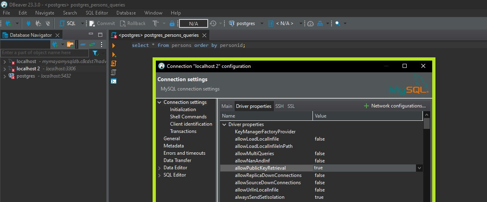
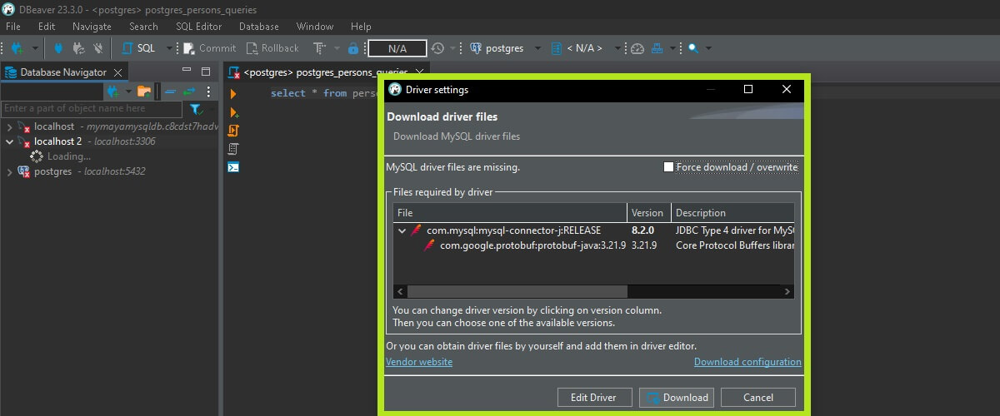

# PT_Demo_MySQL

## Contents

- [Docker Setup](#docker-setup)
- [Database Setup](#database-setup)
- [Application Setup](#application-setup)
    - [Using Data.MySql Client](#using-datamysql-client)
    - [Using Dapper](#using-dapper)
- [Known Issues](#known-issues)
    - [Option Not Supported](#option-not-supported)
- [Links](#links)

## Docker Setup

1. Pull the latest MySQL Docker image:

```
docker pull mysql:latest
```

Output:
```
latest: Pulling from library/mysql
e9f2695d7e5b: Pull complete
51a05c734012: Pull complete
2332296fb21b: Pull complete
a7f1d508f977: Pull complete
c20d302a7e41: Pull complete
fc5e4ef7630a: Pull complete
5bfdb6442486: Pull complete
44e64c297aa6: Pull complete
2704e3b13aeb: Pull complete
2427709f5f35: Pull complete
Digest: sha256:b359741e9fb794c4b6e39ea5d14047609c8ed1efcb03ababe61a239b48a165a9
Status: Downloaded newer image for mysql:latest
docker.io/library/mysql:latest
```

2. Run MySQL in a Docker container:

```
docker run -p 3306:3306 -e MYSQL_ROOT_PASSWORD=your-pass-here --name mysql-container mysql:latest
```

Output:
```
2023-12-20 09:11:50+00:00 [Note] [Entrypoint]: Entrypoint script for MySQL Server 8.2.0-1.el8 started.
2023-12-20 09:11:50+00:00 [Note] [Entrypoint]: Switching to dedicated user 'mysql'
2023-12-20 09:11:50+00:00 [Note] [Entrypoint]: Entrypoint script for MySQL Server 8.2.0-1.el8 started.
2023-12-20 09:11:51+00:00 [Note] [Entrypoint]: Initializing database files
2023-12-20T09:11:51.161173Z 0 [System] [MY-015017] [Server] MySQL Server Initialization - start.
...
```

⚠️ WARNING: if you don't set `MYSQL_ROOT_PASSWORD` environment variable in the command, the following error occurs:

```
...
2023-12-20 09:08:24+00:00 [ERROR] [Entrypoint]: Database is uninitialized and password option is not specified
    You need to specify one of the following as an environment variable:
    - MYSQL_ROOT_PASSWORD
    - MYSQL_ALLOW_EMPTY_PASSWORD
    - MYSQL_RANDOM_ROOT_PASSWORD
```

## Database Setup

3. Open DBeaver:
- Go to Database Navigation > Create > Connection
- Choose MySQL
- In the `Main` tab, choose the following:
    - Server Host: localhost
    - Port: 3306
    - User: root
    - Password: your-pass-here
- In the `Driver Properties` tab, change:
    - allowPublicKeyRetrieval: true



4. Connect using the newly created Connection in step 3.

⚠️ WARNING: If the following error occurs, you may need to download and install MySQL driver files through the DBeaver UI's Driver Settings:



5. Create new database `TestDb`

6. Create new table `Person` by executing the following SQL query:

```
CREATE TABLE Person(
PersonID SERIAL PRIMARY KEY NOT NULL,
FirstName varchar(255),
LastName varchar(255),
Address varchar(255),
City varchar(255),
Age int,
IsMale boolean);
```

7. Populate some Persons in the table:

```
INSERT INTO Person(FirstName, LastName, Address, City, Age, IsMale)
VALUES('Petar', 'Totev', '23 Tri ushi str.', 'Sozopol', 34, 1);

INSERT INTO Person(FirstName, LastName, Address, City, Age, IsMale)
VALUES('Johnny', 'Cash', '11 Jail str.', 'Oklahoma', 100, 1);

INSERT INTO Person(FirstName, LastName, Address, City, Age, IsMale)
VALUES('Louis', 'Armstrong', '1 Utah jazz str.', 'New Orleans', 1234, 1);
```

## Application Setup

8. Create a new .NET Console Application having Client.cs class that will contain all Repositories implemented in the demos that follow.

### Using Data.MySql Client

9. Install the following NuGet package:

```
dotnet add package MySql.Data
```

10. Implement `PersonMySqlDataRepository.cs` containing all necessary CRUD methods using `MySql.Data` NuGet package.

11. Execute the `client.ExperimentWithMySqlDataRepo()` through `Program.cs` in order to test the methods.

### Using Dapper

9. Install the following NuGet package:

```
dotnet add package Dapper
```

10. Implement `PersonDapperRepository.cs` containing all necessary CRUD methods using `Dapper` NuGet package.

11. Execute the `client.ExperimentDapperRepo()` through `Program.cs` in order to test the methods.

## Known Issues

### Option not supported

In case your .NET application is using `MySql.Data` (and not `Dapper`) and you are using options in the connection string like `checkparameters` or `Procedure Cache Size`, `option not supported` error might occur:

```
Data Source=mysql;User Id=test;Password=adminadmin;Procedure Cache Size=10000;checkparameters=true;
```

⚠️ ERROR:
```
System.ArgumentException : Option 'procedure cache size' not supported.
System.ArgumentException : Option 'checkparameters' not supported.
```

✅ FIX:

Use `Dapper` instead of `MySql.Data`

## Links
- https://ganeshchandrasekaran.com/dbeaver-public-key-retrieval-is-not-allowed-77eba055bbcd
- https://stackoverflow.com/questions/1772025/sql-data-reader-handling-null-column-values
- https://stackoverflow.com/questions/55448558/option-not-supported-error-when-using-sql-server-with-mysql